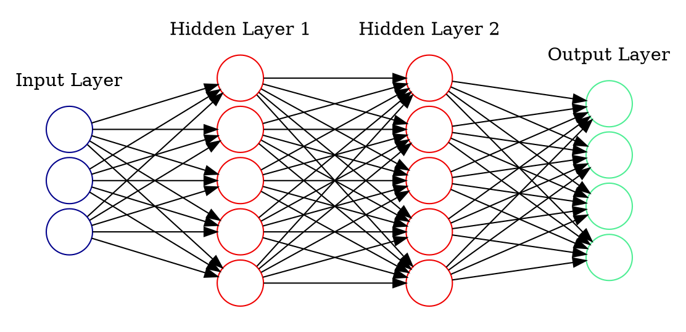

# Graph

```graphviz
digraph G {
        rankdir=LR
	splines=line
        nodesep=.05;
        node [label=""];
        subgraph cluster_0 {
		color=white;
                node [style=solid,color=blue4, shape=circle];
		x1 x2 x3;
		label = "Input Layer";
	}
	subgraph cluster_1 {
		color=white;
		node [style=solid,color=red2, shape=circle];
		a12 a22 a32 a42 a52;
		label = "Hidden Layer 1";
	}
	subgraph cluster_2 {
		color=white;
		node [style=solid,color=red2, shape=circle];
		a13 a23 a33 a43 a53;
		label = "Hidden Layer 2";
	}
	subgraph cluster_3 {
		color=white;
		node [style=solid,color=seagreen2, shape=circle];
		O1 O2 O3 O4;
		label="Output Layer";
	}
    { x1 x2 x3 } -> { a12 a22 a32 a42 a52 }
             -> { a13 a23 a33 a43 a53 }
             -> { O1 O2 O3 O4 }        
       
}
```