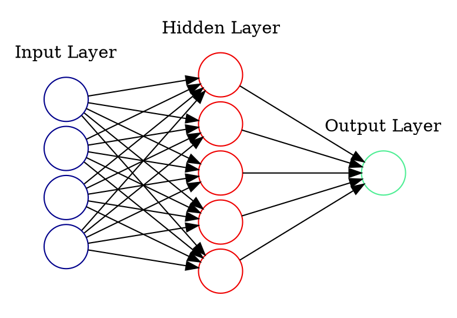

# Graph

```graphviz
digraph G {
        rankdir=LR;
		splines=line;
        nodesep=.05;
        node [label=""];
    subgraph cluster_0 {
		color=white;
                node [style=solid,color=blue4, shape=circle];
		x1 x2 x3 x4;
		label = "Input Layer";
	}
	subgraph cluster_1 {
		color=white;
		node [style=solid,color=red2, shape=circle];
		a12 a22 a32 a42 a52;
		label = "Hidden Layer";
	}
	subgraph cluster_2 {
		color=white;
		node [style=solid,color=seagreen2, shape=circle];
		O1;
		label="Output Layer";
	}
    { x1 x2 x3 x4} -> { a12 a22 a32 a42 a52 } -> { O1 }        
}
```
